# How to Get Started With React and Vite
*This is step by step instructions on how to set up and get started with the JavaScript library **React** and the frontend development tool **Vite**.*

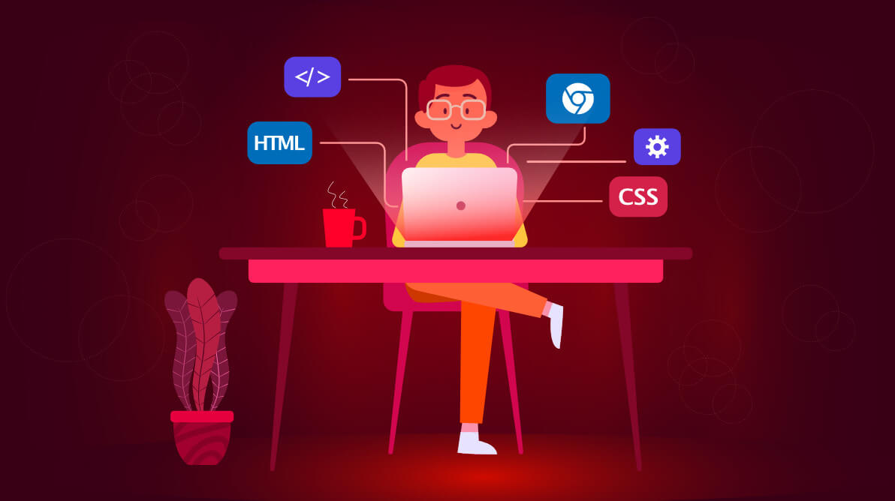
## Introduction
### Goals/Outcomes
* Learn how to set up a Vite project that uses React.
* Learn how to set up and navigate the default file structure of a Vite React project.
* Learn how to properly implement components.
* Learn how to properly implement pages.
* Learn how to use the Vite Dev tool.
### Background
#### Frontend Web Development
Web Development is broken down two main components, **Front-End** and **Back-End**. These instructions pertain to front-end development. 

Front-end development deals with what users see and interact with on a webpage. To accomplish this, three core technologies are used:
 * **HTML** : Provides the structure of a webpage.
 * **CSS** : Provides the styling of a webpage. 
 * **JavaScript** : Provides the functionality and behavior of a webpage.
This document assumes a basic understanding of these technologies. Other technologies (frameworks and libraries) have been built on top of this core to improve the experience and capabilities of front-end web development.
#### What Is React
 React is a Javascript Library for building interactive and fast user interfaces (UI). React is often used in web applications, such as websites. React was built by Meta to improve Facebook. It is now the most popular coding library globally, used around the world to easily build and maintain UI. One of the core features of React is building reusable components that enable developers to make scalable and complex applications with ease. 
#### What is Vite
Vite is a frontend build tool that released two years ago in 2021. Since then, its popularity has been increasing rapidly, becoming the most liked and competing for the most used build tool. Vite provides two major features:
* **Dev Server** : The Vite dev server provides immediate feedback to changes made in the code of the application. 
* **Build Tool** : The Vite build tool bundles everything together for production in a highly optimized manner. 
The details on how Vite accomplishes these are not important to this guide, but they can be found on the Vite Getting Started page ( https://vite.dev/guide/). Additionally, Vite makes transpiling TypeScript faster. 

#### TypeScript Note
This guide will be using TypeScript. TypeScript has become an industry standard. It is a typed superset of JavaScript, and it is transpiled into JavaScript to be run. 

### Pre-Setup
#### Install Code Editor
*Note: Code editor is preference, but the instructions are written with Visual Studio Code (VS Code) and VS Code extensions in mind.* 
1. Install VS Code.
2. Install necessary extensions:
	* ES7+ React/Redux/React-Native Snippets
3. (Optional) Install optional extensions for convenience :
	* Prettier-Code Formatter
	* Live Server
	* htmltagwrap
	* ESLint 
#### Node.JS
*Note: If you have basic experience with JavaScript, you likely already have Node.JS installed*
1. Open command prompt (Windows).
2. Check if Node.JS is installed and version To check if installed, enter command:
	`node -v` 
3. Check version of npm:
	`npm -v`
4. If either of these commands do not work, go to Node.JS website and follow the installation instructions. 
## Instructions Part 1: Single Page Application
### Step 1: Setting up Vite/React Project Template 
1. Navigate to an empty directory 
	* In VS Code, open terminal by pressing 
		(<kbd>Ctrl</kbd> + <kbd>`</kbd>)
	* Use `cd` command to navigate to preferred directory use `mkdir` to make a new empty folder
2. Initialize Vite project
	1. In VS Code terminal enter `npm create vite@latest` and follow prompts:
		1. `Project name:` Enter preferred name of project.
		2. `Select a framework:` Use arrows to scroll to `React` and select it.
		3. `Select a variant:` Use arrows to scroll to `TypeScript` and select it.
	2.  Navigate to the new folder and install dependencies. The terminal should read`Done. Now run:` Follow the given instructions, enter:
		1. `cd <project-name>` to change the directory to the project directory.
		2. If not already in the Directory in VS Code, use  `code .` to open the directory in VS Code. The terminal may need to be reopened   (<kbd>Ctrl</kbd> + <kbd>`</kbd>)
		3. `npm install` to install the necessary dependencies. This may take a few moments.
		4. `npm run dev` to run the Vite template project locally. If everything was done properly, the terminal should look like the following screenshot: 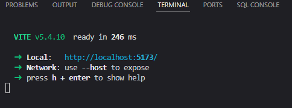
			*  `npm run dev` runs the Vite dev tool. To stop it, enter the terminal it is running in and press (<kbd>ctrl</kbd> + <kbd>c</kbd>)
	1. View the template project in the browser.
		* View the project in browser by typing the `http://localhost:5173/` in the search bar, or by pressing (<kbd>ctrl</kbd> + <kbd>click</kbd>) on the link provided in the terminal. The browser should show a working page as shown in the following screen shot. 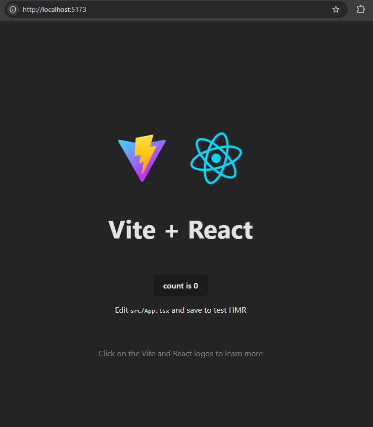
### Step 2: File Structure
*Note: Take time to explore the files in the project, this guide will not go into great depth on the existing file structure.*
1. Create two new folders in `src` directory:
	1. Create a "`components`" folder.
	2. Create a "`pages`" folder.
		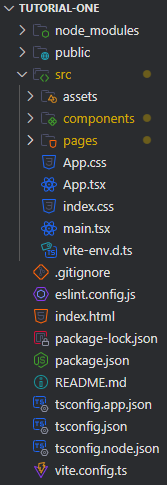
*Note: To create a folder or file right click the desired parent directory and select "New Folder".* 
### Step 2.5: Remove previous Formatting (Optional)
*Note: the Template has some default CSS styling that can be removed or edited *
* delete index.css
* delete app.css
* in main.tsx remove import './index.css'
### Step 3: Making a Component
1. Create a new file in the "components" folder
	* Name format: Pascal Case (capital first letter of every word, no spaces).
	* File Type: May be jsx/tsx, js/ts, and css files. 
2. Name the component "FirstComponent.tsx".
3. Navigate within the "FirstComponent" file, it should be completely empty. 
4. Type `rafce` and enter. 
	* This is a shortcut from the required extension. It means "React Arrow Function Export Component". 
	* The resulting code should look like the following screenshot: 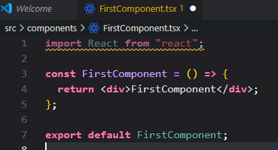
	* Special react syntax, which is known as JSX or TSX is used here. It looks a lot like HTML and may be used after `return` where the *div*s are. Note: The whole return needs to be wrapped in one tag, such as `<></>`, which is a special component for this purpose call a *React Fragment* or simply wrap with `

`. 
5. Save, save with the keyboard shortcut (<kbd>ctrl</kbd> + <kbd> s </kbd>) . 
### Step 4: Making a Page
*Note: Making a page follows the same steps as making a component*.
1. Create a new file in the "pages" folder
	* Name format: Pascal Case (capital first letter of every word, no spaces).
	* File Type: May be jsx/tsx, js/ts, and css files. 
2. Name the component "FirstPage.tsx"
3. Navigate within the "FirstPage" file, it should be completely empty. 
4. Type `rafce` and enter. 
	* This is a shortcut from the required extension. It means "React Arrow Function Export Component". 
5. Import Components the page will be using.
	* At the top of the file, write: 
		`import FirstComponent from "../components/FirstComponent";`
6. Use the component:
	* After `return` write `<FirstComponent/>` 
	* Any number of components may be used, but it requires them all to be wrapped in a single component. Use the React Fragment (`<> </>`) to do this. 
	* JSX/TSX can be used in the pages the same way it can be used in the components.
	* "FirstPage.tsx" file should look something like this: 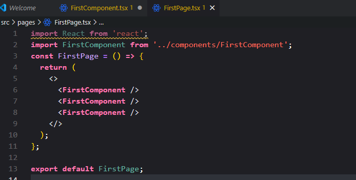
### Step 5: Displaying Pages on the Browser
*Note: App.tsx follows the same rules as components and pages*
1. Open App.tsx
	* Inside of the "src" directory, there is a file called "App.tsx"
2. Clear the template code
	* Delete everything in the `return` that is between the React Fragment
	* Delete the React Hook ( `const [cont,setCount] = useState(0)`)
	* Delete the imports at the top of the file
	* After everything is deleted, it should look like the following image: 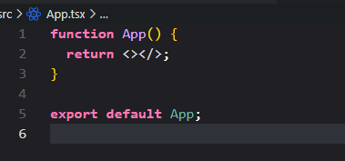
3. Import Pages
	* At the top of the file, write: 
		`import FirstPage from "./pages/FirstPage";`
4. After `return` write `<FirstPage/>` 
	* Any number of pages may be used, but it requires them all to be wrapped in a single component. Use the React Fragment (`<> </>`) to do this. 
	* JSX/TSX can be used in the pages the same way it can be used in the components and pages. 
5. Save. Open the browser from before or reopen the url, the single page application should be completed: 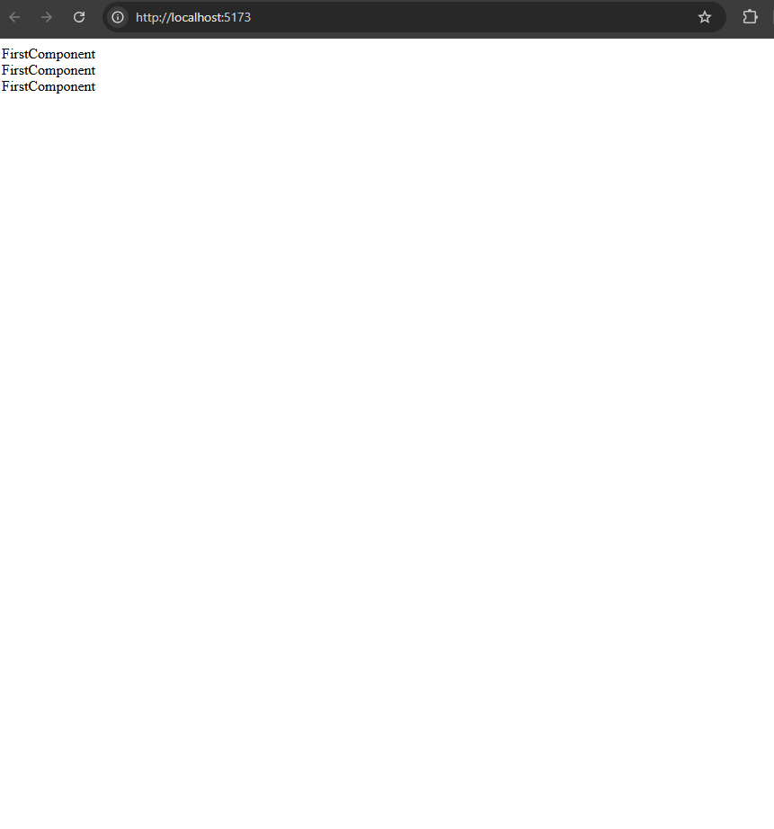

## Instructions Part 2: Multiple Page Application
*There are many ways to navigate between pages with react. This will be showing the current recommended method*
* To proceed, install "react-router-dom" by entering `npm install react-router-dom` in the terminal
* This may take a few moments. 
### Step 1: Menu Component and Linking to Other Pages
*To navigate through multiple pages it's helpful to have a menu or a Navigation bar*
1. Follow Part 1, Step 3 to make "MenuComponent.tsx". 
2. import {Link} from 'react-router-dom' at the top of the page
3. follow the template provided in the following image: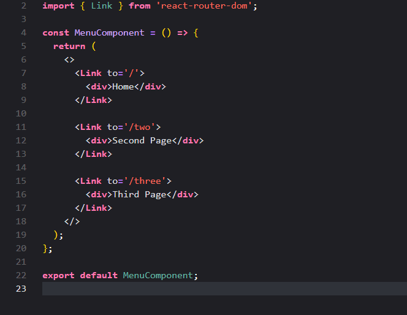
	* This is defining Routes to different URLs, but nothing will be there, yet. 
4. The first page will be a landing page with out a navbar, so for convenience, import and add the Menu Component to the first page. It will look like: 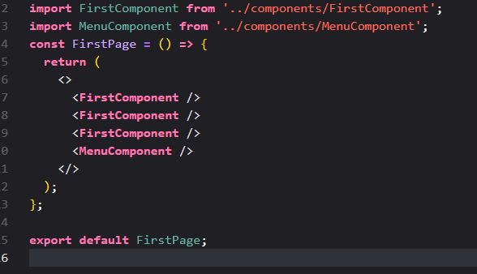

### Step 2: Multiple Page Functionality 
1. Follow Part 1, Step 3 to make "SecondComponent.tsx" and "ThirdComponent.tsx".
3. Follow Step 4 to make "SecondPage.tsx", "ThirdPage.tsx" and "NotFoundPage.tsx"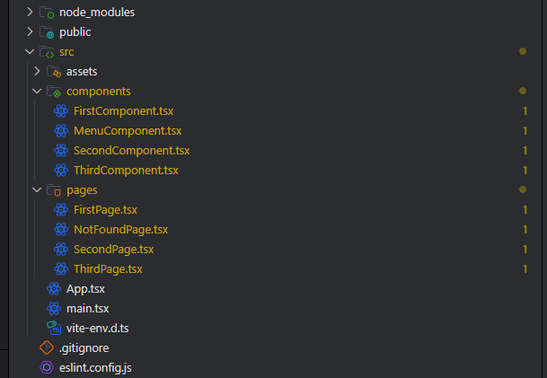
5. Navigate to App.tsx
6. Import SecondPage, ThirdPage, NotFoundPage and Menu Component
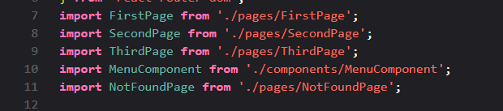

### Step 3: Construct React Browser Router
*Note: Putting new content at different routes, adds functionality for multiple webpages.*'
*Everything in Step 3 is in the App.tsx File*
1. import in react-router-dom functions in App.tsx: 
	* createBrowserRouter,*\
	* RouterProvider
	* Outlet
	* Scroll Restoration
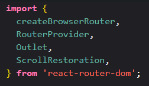
2. Make function called Navbar wrapper outside of App function
	* This function will be used to wrap all desired pages in a uniform format. In this case it will add the list from the Menu Component to the top. 
	* Scroll restoration is a nice feature that ensures webpages go to the top when moving between links. 
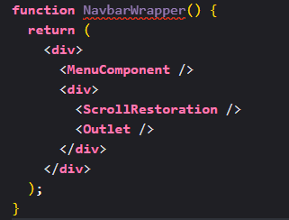
3. Create Browser Router: 
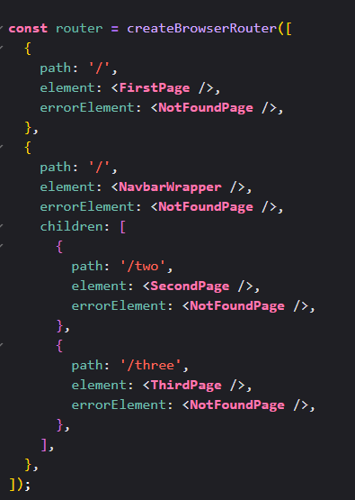
*  The first element is a landing page, 
* Everything under the NavbarWrapper in the "[ ]" will be wrapped in the function previously built. 
* 
4. Finally, to put this all together in the app function, remove what you previously put there and put this:
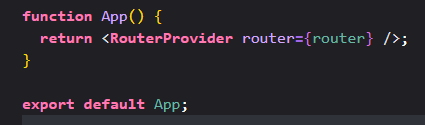
* The path is the extension to the page. 
* You will notice that the navbar is not on the first page. The way this is set up, there will be a default wrapper, in this case the nav component all pages except the first. 
* The error element will show up if you navigate to a page the does not exist. 
* Save, open the browser and click through the links.

## Conclusion
### Final Product
* Home Page:
	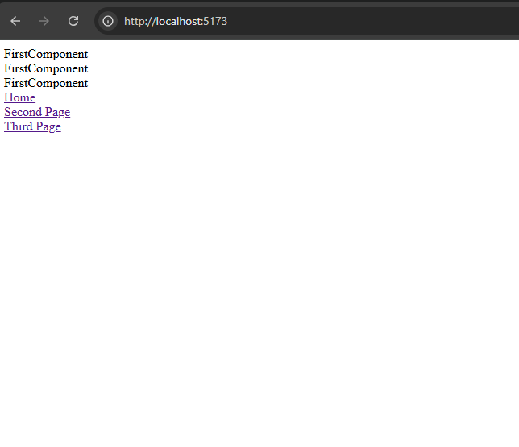
* Second Page:
	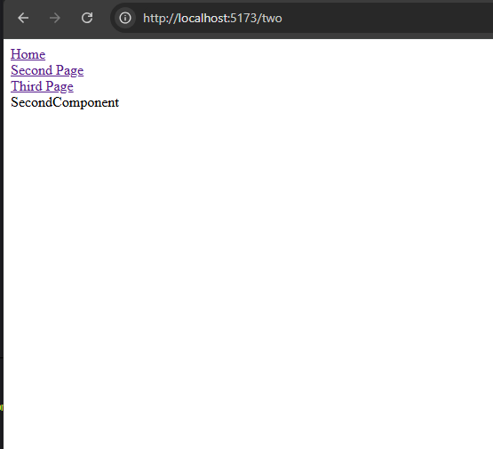
* Third Page: 
	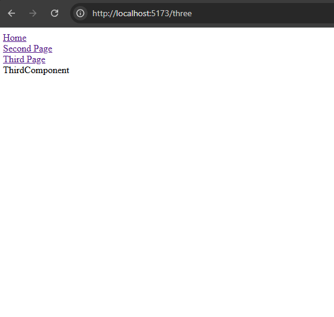
* Not Found Page: 
	* try typing a path in the search bar (like where the two is) that does not exist: 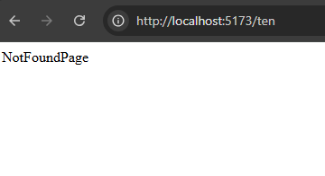
### Other Concepts to explore:
* Building pages with JSX/TSX
	* Structure pages and fill with content.
* Styling with CSS
	* Fill pages and components with color, formatting, layout etc.
* React Hooks
	* Add reusable, state based dynamic elements to the application.
* CSS Frameworks like Tailwind CSS
	* Make formatting and layout extremely accessible and scalable. 

